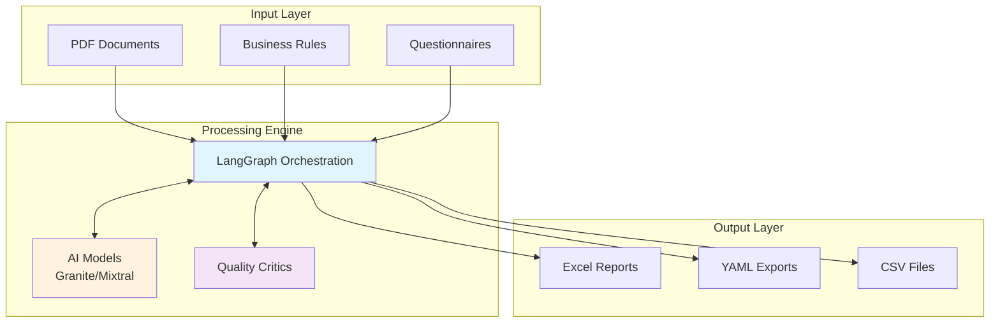
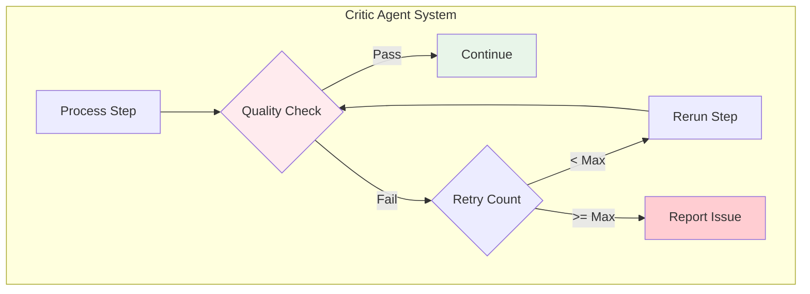
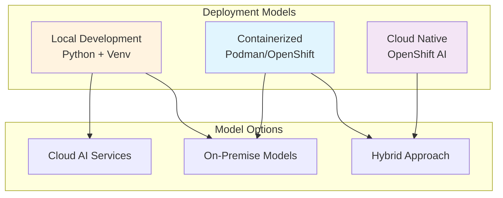
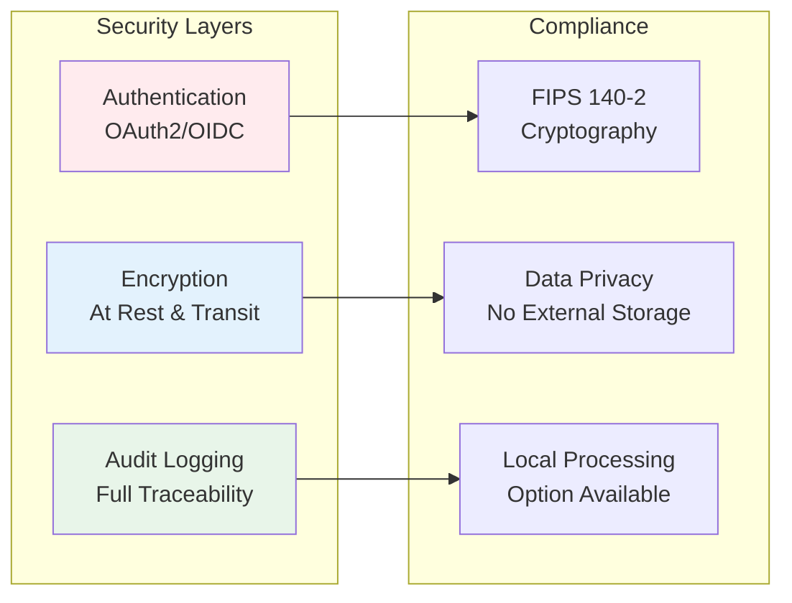
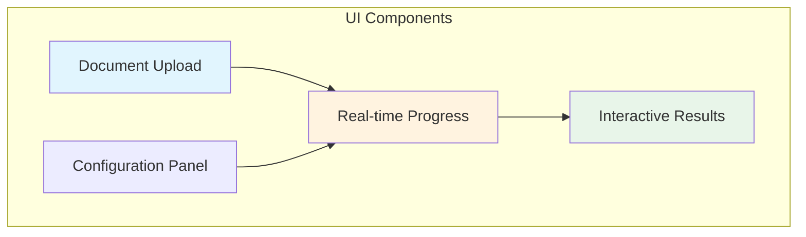
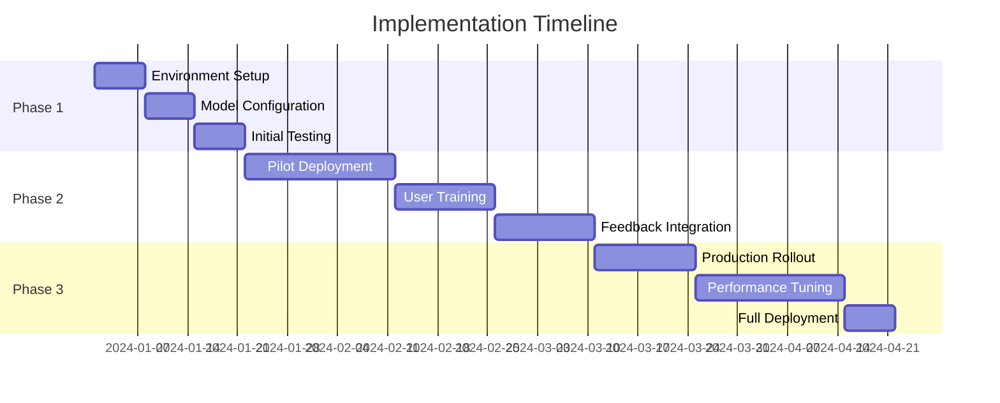

# Legal Document Analysis System - Architecture Briefing

## Executive Summary

The Legal Document Analysis System is an AI-powered solution that automates contract review and compliance checking. It leverages advanced language models to classify document content, answer questionnaires about contract terms, and evaluate compliance with business rules - all with precise page-level citations.

## System Overview

## Core Capabilities

### 1. Document Classification
- **Automated Categorization**: Classifies every sentence into business/legal categories
- **Intelligent Mapping**: Uses AI to understand context and apply appropriate labels
- **Coverage Validation**: Ensures no important content is missed

### 2. Questionnaire Processing
- **Automated Q&A**: Answers complex questions about contract terms
- **Citation Tracking**: Provides exact page references for every answer
- **Confidence Scoring**: Indicates reliability of each response

### 3. Rules Compliance (Optional)
- **Business Rule Evaluation**: Checks documents against predefined criteria
- **Exception Handling**: Identifies and reports rule violations
- **Compliance Reporting**: Clear status for each rule (Compliant/Non-Compliant/Needs Review)

## Technical Architecture

### Three-Phase Workflow

```mermaid
graph LR
    subgraph "Phase 1: Preparation"
        A1[Preflight Checks] --> A2[PDF Conversion]
        A2 --> A3[Quality Validation]
    end
    
    subgraph "Phase 2: Analysis"
        B1[Document Loading] --> B2[Entity Extraction]
        B2 --> B3[Classification]
        B3 --> B4[Rules Evaluation]
    end
    
    subgraph "Phase 3: Output"
        C1[Q&A Processing] --> C2[Citation Validation]
        C2 --> C3[Report Generation]
    end
    
    A3 --> B1
    B4 --> C1
    
    style A1 fill:#e8f5e9
    style B3 fill:#e3f2fd
    style C3 fill:#fff9c4
```

### Quality Assurance System

The system employs multiple "critic agents" that validate quality at each step:
- **PDF Conversion Critic**: Ensures document conversion quality
- **Classification Critic**: Validates categorization completeness
- **Citation Critic**: Verifies page references are accurate
- **Questionnaire Critic**: Confirms all questions are answered

## Key Technologies

### AI Models
- **IBM Granite 3.3**: Primary model for document analysis
- **Mixtral**: Optional validation model for dual-model verification
- **Local Models**: Support for on-premise deployment via Ollama

### Infrastructure
- **LangGraph**: Orchestrates complex multi-step workflows
- **FastAPI**: High-performance API backend
- **Streamlit**: Interactive user interface
- **OpenShift**: Enterprise-grade container platform

## Deployment Options

## Performance & Scalability

### Processing Metrics
- **Document Processing**: 10-50 pages per minute
- **Classification Accuracy**: 95%+ with critic validation
- **Citation Precision**: Page-level accuracy with validation
- **Batch Processing**: Supports parallel document analysis

### Optimization Features
- **Intelligent Caching**: Reduces redundant API calls
- **Batch Classification**: Processes multiple sentences simultaneously
- **Selective Logging**: Minimizes storage overhead
- **Progress Tracking**: Real-time status updates

## Security & Compliance

## User Interface

### Streamlit Dashboard

### Key Features
- **Drag-and-drop** document upload
- **Real-time progress** tracking with step-by-step visibility
- **Interactive results** with filtering and export options
- **Side-by-side comparison** for dual-model mode

## Output Formats

### Excel Reports
- **Multi-sheet workbooks** with organized sections
- **Color-coded compliance** status
- **Hyperlinked citations** to source pages
- **Executive summary** dashboard

### Structured Data
- **YAML**: Machine-readable analysis results
- **CSV**: Tabular data for further analysis
- **JSON**: Complete workflow state for debugging

## ROI & Business Value

### Efficiency Gains
- **80% Reduction** in manual contract review time
- **100% Coverage** of document content (vs. sampling)
- **Immediate Turnaround** for compliance checks
- **Consistent Analysis** across all documents

### Risk Mitigation
- **Complete Traceability**: Every decision is cited and logged
- **Quality Validation**: Multiple checks ensure accuracy
- **Compliance Tracking**: Systematic rule evaluation
- **Audit Trail**: Full documentation of analysis process

## Implementation Roadmap

## Support & Maintenance

### Monitoring
- **Performance metrics** tracked in real-time
- **Error rates** monitored and alerted
- **Usage analytics** for capacity planning

### Updates
- **Model improvements** deployed seamlessly
- **Rule updates** without code changes
- **Feature additions** via configuration

## Contact & Resources

- **Technical Documentation**: See ARCHITECTURE.md for detailed technical information
- **API Documentation**: Available via FastAPI /docs endpoint
- **Support**: Internal IT helpdesk or development team
- **Training Materials**: Available on internal knowledge base

---

*This system represents a significant advancement in contract analysis automation, combining enterprise-grade security with cutting-edge AI capabilities to deliver measurable business value.*