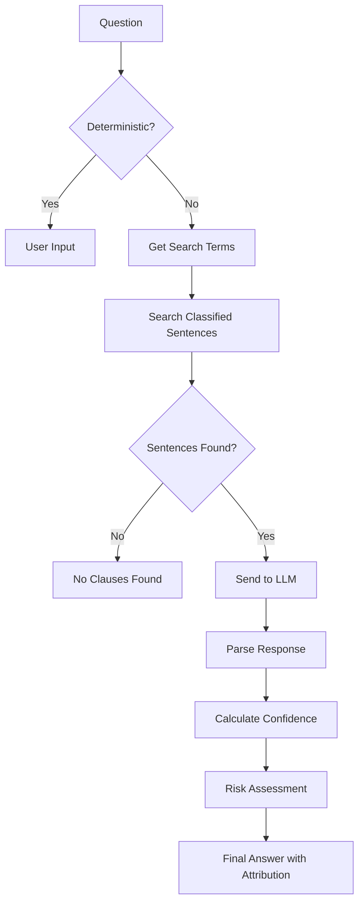

# Decision Attribution Tracking System

## Overview

The enhanced contract analysis workflow now includes comprehensive decision attribution tracking, providing complete transparency about how each answer was determined. This system tracks whether answers came from LLMs, classification-based filtering, deterministic rules, or other sources.

## Key Features

### 1. Decision Method Tracking

Every answer is categorized by how it was determined:

- **Deterministic**: Pre-defined fields (document name, reviewer, etc.)
- **No Relevant Clauses**: No sentences found containing the searched terms
- **LLM-Based**: AI model analysis (tracks which model: Granite, Mixtral, Ollama, etc.)
- **Classification-Based**: Based on document classification results
- **Rule-Based**: Based on compliance rule evaluation
- **Reference Comparison**: Based on deviation from reference document
- **Error**: Processing failure requiring manual review

### 2. Complete Attribution Details

For each question answered, the system tracks:

- **Method**: How the answer was determined
- **LLM Used**: Which specific model was consulted (if applicable)
- **Prompt**: What was sent to the LLM (truncated for storage)
- **Raw Response**: The actual LLM response
- **Reasoning**: The LLM's explanation for its answer
- **Source Evidence**: Number and content of relevant sentences
- **Search Terms**: Which classification terms were searched
- **Processing Time**: How long the decision took
- **Token Count**: Number of tokens processed
- **Confidence Score**: How confident the system is in the answer
- **Warnings**: Any issues encountered
- **Review Required**: Flag for manual review needs

## Activation

To enable enhanced attribution tracking, set the environment variable:

```bash
export USE_ENHANCED_ATTRIBUTION=true
```

Or add to your `.env` file:

```
USE_ENHANCED_ATTRIBUTION=true
```

## Output Formats

### 1. Enhanced YAML Output

The questionnaire YAML now includes attribution for each answer:

```yaml
contract_evaluation:
  part_2_key_clause_analysis:
    questions:
      - id: ip_rights
        answer: "No IP rights transfer specified"
        confidence: "95.0%"
        answer_source: "granite-3.3-8b-instruct"
        attribution:
          method: no_relevant_clauses
          searched_terms: ["intellectual_property_rights"]
          rationale: "No clauses found containing terms: intellectual_property_rights"
          processing_node: classification_based_filtering
```

### 2. Decision Attribution Report

A separate `decision_attribution_report.yaml` provides detailed breakdowns:

```yaml
decisions:
  ip_rights:
    question: "What IP rights are transferred?"
    answer: "No IP rights transfer specified"
    method: no_relevant_clauses
    confidence: "100.0%"
    evidence:
      searched_terms: ["intellectual_property_rights"]
      source_sentences_found: 0
```

### 3. Human-Readable Summary

A markdown file `decision_summary.md` provides an easy-to-read overview:

```markdown
## How Answers Were Determined

- **Total Questions**: 45
- **Deterministic Fields**: 6 (13.3%) - Pre-defined fields
- **AI Analysis**: 25 (55.6%) - Granite model
- **No Clauses Found**: 14 (31.1%) - No relevant text in document

## Detailed Decision Attribution

### Key Clause Analysis

**ip_rights**: What IP rights are transferred?
- **Answer**: No IP rights transfer specified
- **Confidence**: 100.0%
- **How Determined**: No clauses found for terms: intellectual_property_rights
```

## Understanding "No Clauses Found"

When the system reports "No clauses found", it means:

1. The document classifier searched for specific terminology
2. No sentences in the document contained those terms
3. The system definitively knows this topic is not addressed
4. This is **not** an error - it's valuable information

Example: If searching for "intellectual_property_rights" finds no matches, the system knows with 100% confidence that IP rights are not explicitly addressed in the contract.

## Decision Flow



## Benefits

### 1. Transparency
- Clear understanding of how each answer was determined
- No "black box" decisions

### 2. Debugging
- Identify why certain answers were given
- Trace back to source sentences and search terms

### 3. Quality Assurance
- Flag low-confidence answers for review
- Identify patterns in processing issues

### 4. Audit Trail
- Complete record of decision-making process
- Timestamps and processing metadata

### 5. Continuous Improvement
- Identify which questions rely too heavily on LLMs
- Find gaps in classification terminology
- Optimize search term mappings

## Statistics Tracking

The system maintains running statistics:

- Total questions processed
- Breakdown by decision method
- Confidence score distribution
- LLM calls by model
- Processing times
- Error rates
- Manual review requirements

## API Usage

```python
from utils.decision_tracker import DecisionAttribution, initialize_decision_tracker

# Initialize tracker
tracker = initialize_decision_tracker()

# Create attribution for a decision
attribution = DecisionAttribution("question_id", "What is the payment term?")

# For no clauses found
attribution.set_no_clauses_found(["payment_terms", "invoicing"])

# For LLM decision
attribution.set_llm_decision(
    llm_name="granite-3.3",
    answer="30 days net",
    confidence=0.85,
    prompt="...",
    raw_response="...",
    reasoning="Found payment terms in section 5.2"
)

# Track the decision
tracker.track_decision(attribution)

# Get summary report
report = tracker.get_summary_report()
```

## Configuration

### Question-to-Term Mapping

Edit the mapping in `questionnaire_processor_enhanced.py`:

```python
mapping = {
    'ip_rights': ['intellectual_property_rights'],
    'limitation_of_liability': ['limitation_of_liability'],
    'indemnity': ['indemnification'],
    # Add more mappings as needed
}
```

### Confidence Thresholds

Answers with confidence below 60% are automatically flagged for review.

## Future Enhancements

1. **Learning System**: Track which term mappings are most effective
2. **Custom Attributions**: Allow plugins for specialized decision methods
3. **Visualization**: Interactive dashboard showing decision flow
4. **Batch Analysis**: Compare attribution patterns across multiple contracts
5. **Feedback Loop**: Incorporate user corrections to improve mappings

## Troubleshooting

### All answers show "No clauses found"

Check:
1. Classification is working correctly
2. Term mappings match actual classification output
3. Document sentences are properly extracted

### Missing attribution data

Ensure:
1. `USE_ENHANCED_ATTRIBUTION=true` is set
2. Using the enhanced processor (check logs for "ENHANCED WITH ATTRIBUTION")
3. State is properly passed between nodes

### Low confidence scores

Review:
1. Quality of source sentences
2. Prompt clarity
3. LLM response parsing

## Summary

The attribution tracking system transforms the contract analysis from a "black box" into a transparent, auditable process. Every decision is tracked, explained, and can be traced back to its source, providing confidence in the results and clear paths for improvement.