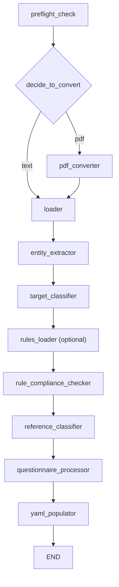
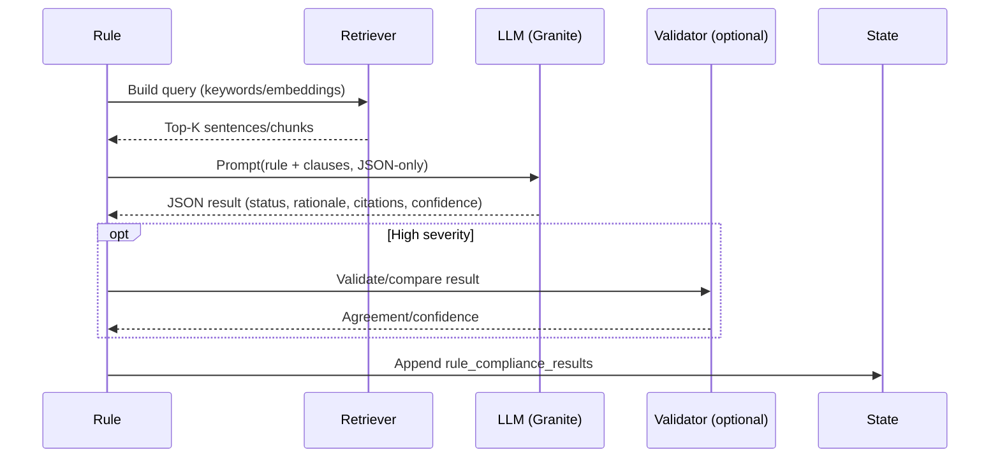

## Rule-driven Compliance Checker Node Design

### Overview
- Ingest a rules file (CSV/XLSX/YAML) with headers: `Name`, `Description`, `Rules`, `Default` (optional: `Severity`, `Keywords`, `Exceptions`).
- Retrieve likely-relevant target text (sentences/chunks) per rule via keyword/BM25 and optional embeddings; prioritize `classified_sentences` by mapped terminology.
- Use a small LLM to judge compliance per rule with a concise JSON output.
- Aggregate per-rule results into `rule_compliance_results`, compute `compliance_metrics`, and surface in YAML/MD reports.

### Workflow integration (proposed)
- Insert `rule_compliance_checker` after `target_classifier` and before `reference_classifier` (so it can run rules-only; optionally include reference context later).



### State additions
- `rules_path: str`
- `rules_data: List[Rule]`
- `rule_compliance_results: Dict[str, Any]` (per-rule records)
- `rule_violations: List[Dict[str, Any]]`
- `compliance_metrics: Dict[str, Any]`

Rule shape (normalized):
```json
{
  "id": "data_audit",
  "name": "Data Audit",
  "description": "Specifies the Customer's rights to audit data processing activities of the Supplier",
  "rule_text": "The Customer is not allowed to visit the Supplier's site for auditing the Supplier's data processing activities.",
  "default_status": "Compliant",
  "severity": "medium",
  "keywords": ["audit", "data processing", "site visit"],
  "exceptions": ["virtual audit", "notice requirement"]
}
```

### Retrieval + evaluation flow per rule
- Candidate selection:
  - Keyword/BM25 over `document_sentences` using `keywords` + terms from `name/description`.
  - Optional embeddings (vLLM-compatible) to retrieve top-K semantically similar sentences.
  - Prioritize sentences within relevant `classified_sentences` classes (simple rule→terminology mapping).
- Chunking:
  - Merge adjacent sentences when needed (max token budget per rule).
- LLM judgment:
  - Prompt with rule context + top-K clauses; require strict JSON:

```json
{
  "status": "compliant | non_compliant | not_applicable | unknown",
  "rationale": "brief why",
  "violating_spans": ["optional snippets"],
  "citations": ["sentence_ids"],
  "confidence": 0.0
}
```

- Optional dual validation for high-severity rules using Mixtral/Ollama and `model_comparator`.



### Prompt template (new `prompts/rule_compliance.yaml`)
Inputs: `rule_name`, `rule_description`, `rule_text`, `default_status`, `target_clauses`

```text
You are a contract compliance checker.

Rule:
- Name: {rule_name}
- Description: {rule_description}
- Operative Constraint: {rule_text}
- Default Status if no contrary language is found: {default_status}

Evaluate the following contract clauses from the target document:
{target_clauses}

Respond ONLY with JSON:
{"status": "compliant | non_compliant | not_applicable | unknown", "rationale": "...", "violating_spans": ["..."], "citations": [1,2], "confidence": 0.0}
```

### Outputs
Per-rule record example:
```json
{
  "rule_id": "data_audit",
  "status": "non_compliant",
  "rationale": "Clause grants onsite audit rights contrary to rule.",
  "citations": ["s123", "s124"],
  "violating_spans": ["Customer may audit Supplier's facilities"],
  "confidence": 0.82,
  "severity": "high"
}
```

Aggregations:
- `rule_violations`: list of non-compliant findings with evidence
- `compliance_metrics`: counts by status/severity; coverage (% rules with decision)

### Performance & controls
- Top-K per rule (e.g., 5–10), batch rules by topic, cache embeddings per run.
- Temperature 0–0.1, conservative `max_tokens`.
- Flags: `--rules-file`, `--top-k`, `--validate-high-severity-only`.

### Integration points
- New node: `rules_loader` (parse CSV/XLSX/YAML) → `rules_data` in state.
- New node: `rule_compliance_checker` (retrieval+LLM) → `rule_compliance_results`, `rule_violations`, `compliance_metrics`.
- Reporting: add "Rules Compliance" section to YAML/MD; optional Excel tab.

### Optional: leverage reference/baseline
- If enabled, include matched reference clauses as “expected practice” context for tighter judgments; keep rules-only mode as default.
